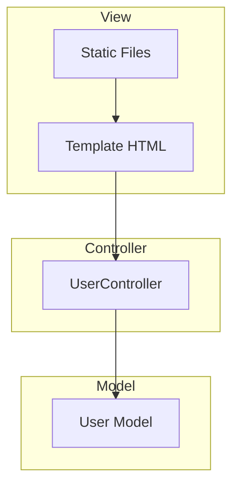

# Projeto MC426

## Membros

- Erika Tiemi Santos Hacimoto (RA 244953)
- Gabriel Jeronimo da Silva (RA 247112)
- Raphael Ferezin Kitahara (RA 244839)
- Luiza Coelho de Souza (RA 247257)
- Guilherme Henrique Ichiro Seto Ito (RA 238706)
- Pedro Henrique Peraçoli Pereira Ceccon (RA 247327)

## Descrição do Projeto
O software a ser desenvolvido é uma plataforma integrada de sistemas de compatibilidade e mapas colaborativos. Essa plataforma terá como objetivo principal conectar pessoas interessadas em caminhar ou pedalar ao mesmo tempo, fornecendo uma experiência mais segura ao realizarem um ato de socialização. Os principais recursos incluem um meio de realizar "matches" entre os usuários com rotas similares, possibilidade de avaliação de outros usuários por meio de feedbacks e informações detalhadas sobre locais inseguros e infraestruturas ruins.

Além disso, a plataforma oferecerá funcionalidades de interação, que com a posterior escalabilidade do sistema, possivelmente haverá uma implementação de um chat com outros usuários e integração com outros aplicativos para aumentar o engajamento dos usuários em relação às devidas atividades físicas. A segurança e a confiabilidade serão prioridades, garantindo que os dados sejam protegidos e que o usuário também se sinta seguro ao iniciar uma atividade juntamente com outro usuário, muitas vezes, desconhecido, através de um sistema de avaliação. O software será desenvolvido utilizando uma abordagem ágil, permitindo adaptações rápidas às necessidades dos usuários.

## Arquitetura do Sistema

### Diagrama de Componentes (C4 - Nível 3)

### Estilo Arquitetural

O sistema adota o padrão arquitetural **MVC (Model-View-Controller)**:

1. **Model (Modelo)**
   - Representa os dados e a lógica de negócio
   - Contém as regras de validação
   - Gerencia o estado dos dados

2. **View (Visão)**
   - Interface com o usuário
   - Templates HTML
   - Arquivos estáticos (CSS, JavaScript)

3. **Controller (Controlador)**
   - Processa as requisições
   - Coordena a interação entre Model e View
   - Implementa a lógica de aplicação

### Componentes Principais

1. **Model**
   - **User**: Classe que representa um usuário e suas validações

2. **View**
   - **Templates**: Arquivos HTML para renderização
   - **Static**: Arquivos CSS e JavaScript

3. **Controller**
   - **UserController**: Gerencia as operações relacionadas a usuários

### Padrão de Projeto

Para o componente de gerenciamento de usuários, será implementado o padrão **MVC**. Este padrão será utilizado para:

- Separar a lógica de negócio da interface do usuário
- Facilitar a manutenção e testes
- Melhorar a organização do código
- Permitir a reutilização de componentes

A implementação deste padrão será realizada através de uma issue específica com o label "AvaliacaoA4".
