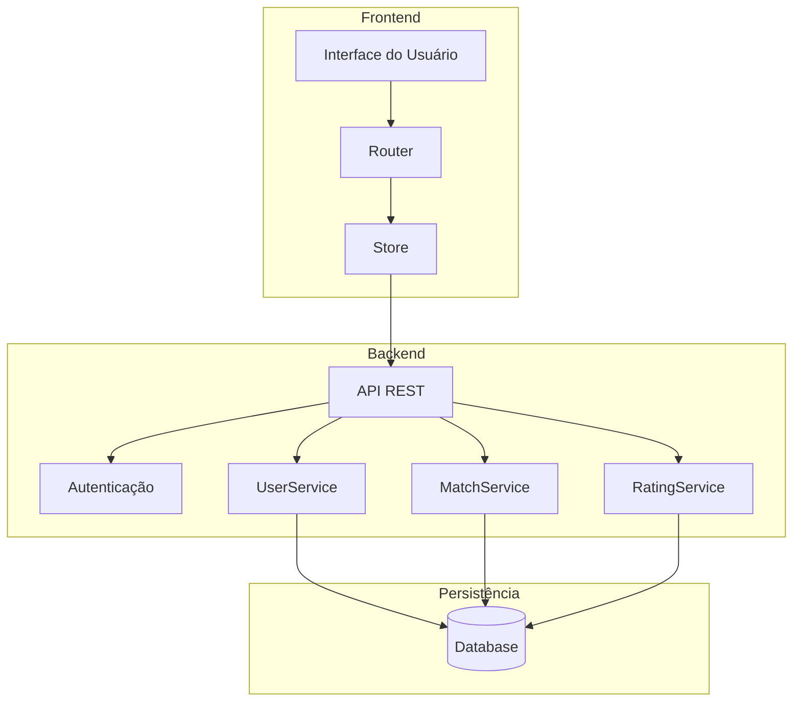

# Projeto MC426

## Membros

- Erika Tiemi Santos Hacimoto (RA 244953)
- Gabriel Jeronimo da Silva (RA 247112)
- Raphael Ferezin Kitahara (RA 244839)
- Luiza Coelho de Souza (RA 247257)
- Guilherme Henrique Ichiro Seto Ito (RA 238706)
- Pedro Henrique Peraçoli Pereira Ceccon (RA 247327)

## Descrição do Projeto
O software a ser desenvolvido é uma plataforma integrada de sistemas de compatibilidade e mapas colaborativos. Essa plataforma terá como objetivo principal conectar pessoas interessadas em caminhar ou pedalar ao mesmo tempo, fornecendo uma experiência mais segura ao realizarem um ato de socialização. Os principais recursos incluem um meio de realizar "matches" entre os usuários com rotas similares, possibilidade de avaliação de outros usuários por meio de feedbacks e informações detalhadas sobre locais inseguros e infraestruturas ruins.

Além disso, a plataforma oferecerá funcionalidades de interação, que com a posterior escalabilidade do sistema, possivelmente haverá uma implementação de um chat com outros usuários e integração com outros aplicativos para aumentar o engajamento dos usuários em relação às devidas atividades físicas. A segurança e a confiabilidade serão prioridades, garantindo que os dados sejam protegidos e que o usuário também se sinta seguro ao iniciar uma atividade juntamente com outro usuário, muitas vezes, desconhecido, através de um sistema de avaliação. O software será desenvolvido utilizando uma abordagem ágil, permitindo adaptações rápidas às necessidades dos usuários.

## Arquitetura do Sistema

### Diagrama de Componentes (C4 - Nível 3)

### Estilos Arquiteturais

O sistema adota os seguintes estilos arquiteturais:

1. **Arquitetura em Camadas (Layered Architecture)**
   - Separação clara entre frontend, backend e persistência
   - Cada camada tem responsabilidades bem definidas
   - Comunicação unidirecional entre camadas

2. **Arquitetura Cliente-Servidor**
   - Frontend como cliente
   - Backend como servidor
   - Comunicação via API REST

### Componentes Principais

1. **Frontend**
   - **Interface do Usuário**: Componentes React para interação com o usuário
   - **Router**: Gerenciamento de rotas e navegação
   - **Store**: Gerenciamento de estado global da aplicação

2. **Backend**
   - **API REST**: Endpoints para comunicação com o frontend
   - **Autenticação**: Gerenciamento de autenticação e autorização
   - **UserService**: Gerenciamento de usuários e perfis
   - **MatchService**: Lógica de matching entre usuários
   - **RatingService**: Sistema de avaliações e feedback

3. **Persistência**
   - **Database**: Armazenamento persistente dos dados

### Padrão de Projeto

Para o componente de gerenciamento de usuários (UserService), será implementado o padrão **Repository Pattern**. Este padrão será utilizado para:

- Abstrair a lógica de acesso a dados
- Centralizar a lógica de persistência
- Facilitar a manutenção e testes
- Permitir a troca da implementação de persistência sem afetar a lógica de negócio

A implementação deste padrão será realizada através de uma issue específica com o label "AvaliacaoA4".
