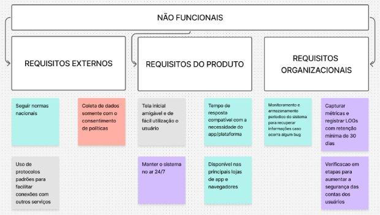
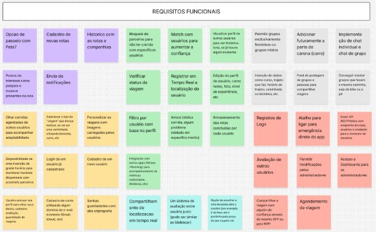

# ELICITAÇÃO DE REQUISITOS

Primeiramente, foi realizado um benchmarking de aplicativos e plataformas com usabilidade parecida do que tínhamos em mente, procurando nos guiar através das funcionalidades e requisitos básicos para o funcionamento do nosso aplicativo.

## 1º Passo: Benchmarking

Foram analisados diferentes tipos de aplicativos que fazem parte do nosso escopo:

- **Apps de roteamento como Komoot e Bikemap**  
  Essas plataformas oferecem **roteamento personalizado para ciclistas**, levando em conta tipos de terreno, elevação, preferências de vias e níveis de habilidade. Elas usam dados colaborativos e mapas detalhados, gerando rotas mais seguras e agradáveis, muitas vezes ignoradas por apps de navegação comuns.

- **Soluções focadas em segurança, como dashcam.bike e OurStreets, que permitem reportar trechos perigosos**  
  Permitem que usuários reportem **situações de risco em tempo real**, como direção agressiva, má iluminação ou buracos, criando um **banco de dados colaborativo de perigos urbanos**. Isso capacita ciclistas e pedestres a evitarem áreas problemáticas e pressiona autoridades a tomarem providências.

- **Plataformas de match social, como WalkClub e WalkPal**  
  Esses serviços conectam pessoas com interesses semelhantes para caminharem juntas com base em **horário, local e ritmo**, promovendo **socialização, segurança e incentivo à atividade física**. O uso de algoritmos de compatibilidade melhora a experiência e reduz barreiras para caminhadas regulares.

- **Apps crowdsourcing de incidentes de trânsito como o Waze**  
  Waze transforma cada motorista em um sensor, criando um sistema em tempo real de alertas sobre acidentes, congestionamentos, blitz, entre outros. A **inteligência coletiva** permite desviar rotas de forma eficiente e dinâmica.

- **Apps de deslocamento com base em rotas como a Uber**  
  O Uber utiliza **algoritmos de roteamento em tempo real**, considerando trânsito, histórico de demanda e até comportamento dos motoristas, para oferecer o **caminho mais eficiente**. Além disso, o sistema aprende com o uso contínuo.

Foi muito útil para a gente entender o que já existe e onde ainda há espaço para reaproveitamento e inovação. Com esse panorama em mãos, fica claro que podemos criar algo diferente ao misturar essas ideias num só lugar e nos guiar para ter um ponta-pé inicial no brainstorming.

## 2º Passo: Brainstorming

Tendo em vista a pesquisa feita e uma noção básica de requisitos para a nossa plataforma, utilizando o Figma (FigJam), utilizamos um quadro branco e post-its para cada um jogar suas ideias e entendermos os requisitos necessário:

Após rounds de 5 minutos para cada um escrever o que vinha em mente, dividimos todos os post-its em subcategorias, de acordo com a finalidade dos requisitos elencados:

## 3º Passo: Consolidação e resumo das ideias

Por fim, consolidamos e detalhamos os requisitos levantados:

### 1. Requisitos Funcionais

#### 1.1 Autenticação e Perfil
  - Cadastro/login  
  - Criar conta via e-mail/senha ou social login (Google/Facebook/Icloud)  
  - Recuperação de senha por e-mail  
  - Verificação em múltiplas etapas

#### 1.2 Gestão de perfil
  - Editar nome, foto, tipo de atividade (bike/caminhada)  
  - Definir preferências: distância, horários, nível de experiência, visibilidade (público/amigos/privado)

#### 1.3 Rotas, Histórico e Offline
  - Criação e edição de rotas  
  - Edição de rotas (integração com o Google Maps para traçar as rotas recomendadas)  
  - Editar e adicionar POIs - Pontos de Interesse (água, oficina, farmácia, delegacia, etc.)  
  - Editar/excluir rotas salvas

#### 1.4 Acompanhamento em tempo real
  - Localização via GPS  
  - Botão de SOS: compartilha localização aos contatos de confiança  
  - Check-in/check-out automático para contato de segurança

#### 1.5 Histórico e estatísticas
  - Armazenar trajeto, data, distância, tempo e elevação  
  - Exibir camadas de calor (rotas populares, áreas de risco)  
  - Mapas offline: download de regiões e sincronização posterior

#### 1.6 Busca e navegação
  - Pesquisar rotas públicas por localização, distância, avaliação

#### 1.7 Compartilhamento social
  - Compartilhar rota via app, WhatsApp, Instagram, Facebook

#### 1.8 Match  
  - Algoritmo de match  
  - Sugerir parceiros por rota, horário, velocidade; filtros por gênero e avaliação

#### 1.9 Convites e agendamento
  - Enviar/aceitar convites (push/e-mail) e agendar saídas únicas ou recorrentes

#### 1.10 Grupos  
   - Criar grupos de rota (bike ou a pé) públicos ou privados

#### 1.11 Interações Sociais & Gamificação
   - Feed de atividades  
   - Linha do tempo: conclusões de rotas, reports de trechos, badges

#### 1.12 Sistema de conquistas
   - Medalhas por km pedalados, matches realizados, reports úteis

#### 1.13 Feedback & Segurança
   - Avaliação de parceiros (tanto nota quanto comentários - destacar incidentes relacionados ao parceiro)  
   - Estrelas + comentários pós-atividade

#### 1.14 Report de incidentes
   - Marcar locais inseguros ou infra estrutura ruim com foto e descrição  
   - Exibir avisos em tempo real sobre problemas relatados

#### 1.15 Bloqueio de usuários
   - Bloquear parceiros com avaliação abaixo de limiar

#### 1.16 Comunicação & Integrações
   - Chat privado (futuro)  
   - Mensagens 1:1 entre usuários que deram match

#### 1.17 Notificações
   - Push/e-mail para convites, mensagens, avisos de risco

#### 1.18 Integração externa
   - Sincronizar/importar atividades de Strava, Garmin Connect, Apple Health  
   - API REST pública (rotas, usuários, avaliações)

#### 1.19 Administração e Auditoria
  - Dashboards e relatórios  
  - Métricas de uso (usuários ativos, matches, incidentes)

#### 1.20 Moderação de conteúdo
  - Filtrar/remover feedbacks indevidos  
  - Logs de auditoria (banimento, exclusões, alterações críticas)

### 2. Requisitos Não Funcionais Externos

#### 2.1 Cumprimento das Normas nacionais

#### 2.2 Privacidade
  - Coletar dados apenas com consentimento explícito  
  - Políticas de retenção e anonimização

#### 2.3 Interoperabilidade
  - Protocolos padrão: OAuth2 para login social, REST/JSON e OpenAPI para APIs

### 3. Requisitos Não Funcionais do Produto

#### 3.1 Desempenho
   - Requisições de API comportando até 1 000 usuários simultâneos (pensando no tamanho da Unicamp e sem pensar na escalabilidade do APP)

#### 3.2 Disponibilidade  
   - Operação contínua 24/7

#### 3.3 Usabilidade
   - Usuário sem treino completa onboarding+match+início de rota em baixo tempo com facilidade

#### 3.4 Compatibilidade  
   - Suporte a Chrome, Firefox, Edge, Safari (versões atuais); iOS/Android

#### 3.5 Segurança
   - Senhas criptografadas; compliance OWASP ***(futuro)***

#### 3.6 Monitoramento
   - Métricas; logs centralizados; alertas

#### 3.7 Confiabilidade
  - Retry automático em timeouts; snapshots do banco de dados periodicamente para evitar colapsar caso de algum problema

### 4. Requisitos Não Funcionais Organizacionais

#### 4.1 Segurança de acesso
   - Fluxo de criação de conta com MFA e validação de e-mail

#### 4.2 Governança e Qualidade
   - Cobertura mínima de testes, revisão de código e documentação obrigatórias

#### 4.3 Operação e Suporte
  - Equipe de operações 24/7; procedimentos de backup e recuperação de desastre ***(futuro)***

### 5. Considerações finais

Outra técnica que pensamos em utilizar foi a de Entrevistas, chegamos até a montar um roteiro de entrevista (abaixo), porém, optamos por não utilizar entrevistas na fase de elicitação de requisitos devido a limitação de tempo dos envolvidos no desenvolvimento e também pela natureza inicial do projeto. Além disso, consideramos que outras técnicas, como benchmarking e brainstorming, seriam mais eficazes neste momento para levantar requisitos com base em soluções consolidadas no mercado e na experiência da equipe. Com isso, buscamos agilidade no processo sem comprometer a qualidade das informações obtidas.

## Roteiro inicial de Entrevista - Elicitação de Requisitos 

**Objetivo:** 
Levantar informações sobre as necessidade de usuário no aplicativo de mobilidade urbana

---

## 1. Introdução
- **Objetivo da Entrevista:** "Estamos desenvolvendo uma plataforma para conectar pessoas que desejam caminhar ou pedalar na universidade, criando uma experiência mais segura e colaborativa. Queremos entender suas necessidades e expectativas em relação a essa plataforma para garantir que ela seja útil e eficaz."
- **Confirmação de consentimento:** "A entrevista será gravada (se for o caso), e todas as informações serão tratadas de forma confidencial."
- **Explicação da dinâmica:** "Esta entrevista deve durar cerca de 30 minutos. Farei algumas perguntas sobre sua experiência com mobilidade na universidade e como você se relaciona com o uso de tecnologia para facilitar essas atividades."

---

## 2. Sobre o Usuário
- **Qual é o seu curso ou área de atuação na universidade?**
- **Você costuma caminhar ou pedalar dentro do campus? Com que frequência?**
- **Quais são as suas principais dificuldades ao caminhar ou pedalar na universidade? (Ex: rotas inseguras, falta de infraestrutura, distância, etc.)**

---

## 3. Necessidades e Problemas
- **Você já teve alguma experiência negativa ou preocupante ao caminhar ou pedalar na universidade?**
- **Quais fatores você considera mais importantes para sentir segurança ao caminhar ou pedalar com outra pessoa?**
- **Você já usou alguma plataforma ou aplicativo para atividades físicas ou para conectar-se com outras pessoas para caminhar ou pedalar? O que gostou e o que não gostou?**

---

## 4. Expectativas sobre a Plataforma
- **Quais funcionalidades você gostaria de ver na plataforma? (Ex: encontrar pessoas com rotas similares, feedback de segurança de rotas, avaliações de outros usuários, etc.)**
- **Como você gostaria de interagir com outros usuários? (Ex: chat, mensagens, notificações)**
- **Você acha importante que o sistema forneça informações sobre locais inseguros ou com infraestrutura ruim? Como você imagina que isso funcionaria?**
- **O que você acha de um sistema de avaliações para aumentar a segurança? Quais critérios seriam importantes para você avaliar outro usuário?**

---

## 5. Usabilidade e Funcionalidades
- **Como você imagina a interface da plataforma? O que ela deve ter de mais importante para você?**
- **Você preferiria uma plataforma exclusiva para caminhadas e ciclismo, ou que ela integrasse outros tipos de atividade física?**
- **Qual seria a sua reação se o sistema sugerisse automaticamente uma rota ou outra pessoa com base no seu perfil de atividade e interesses?**

---

## 6. Restrições e Preferências
- **Você tem algum receio sobre a segurança ou privacidade de seus dados ao utilizar um aplicativo como esse?**
- **Quais funcionalidades você considera essenciais para a plataforma funcionar corretamente desde o início?**
- **Você gostaria que a plataforma fosse integrada a outros apps de atividades físicas ou mapas? Se sim, quais?**

---

## 7. Considerações Finais
- **Há algo mais que você acha importante sobre o uso de tecnologia para atividades de mobilidade no campus que a plataforma deve considerar?**
- **Você teria sugestões de melhorias para garantir maior segurança ou engajamento dos usuários na plataforma?**
- **Você acha que o sistema deveria contar com alguma funcionalidade para alertar sobre situações de emergência durante as atividades?**

---

## 8. Encerramento
- Agradecimento pelo tempo e pelas informações.
- "Caso haja mais alguma dúvida ou sugestão, posso entrar em contato posteriormente. Muito obrigado pela sua colaboração!"

